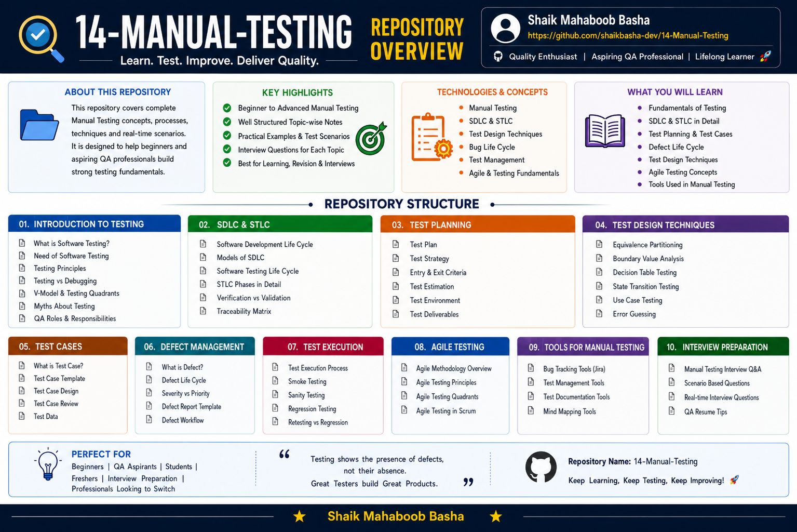

# Manual Testing

## Overview

This repository contains comprehensive notes, practical examples, workflows, comparisons, real-time scenarios, and interview preparation materials covering fundamental and advanced concepts of **Manual Testing**.

The repository is designed as a structured learning resource for students, freshers, QA aspirants, software testing beginners, and professionals preparing for Manual Testing and Quality Assurance roles.

The content covers **Software Testing Fundamentals**, **Software Development Life Cycle (SDLC)**, **Agile and Scrum**, **Testing Types**, **Software Testing Life Cycle (STLC)**, **Defect Management**, and **Advanced Testing Concepts**.

In addition, this repository contains a dedicated **Manual Testing Interview Questions and Answers** section featuring **100 carefully selected interview questions with detailed answers** to support technical interview preparation and quick revision.

Each topic contains structured theory, practical examples, workflows, comparison tables, real-time scenarios, interview questions, and important testing concepts to provide a comprehensive Manual Testing learning experience.

## Repository Overview



## Repository Objectives

This repository is created to:

* Learn the fundamentals of Manual Testing
* Understand Software Development Life Cycle (SDLC)
* Study Agile Methodology and Scrum Framework
* Learn different Software Testing types
* Understand Software Testing Life Cycle (STLC)
* Learn test planning and test case concepts
* Understand test case design techniques
* Learn defect tracking and Bug Life Cycle
* Explore advanced software testing concepts
* Understand real-time software testing scenarios
* Master frequently asked Manual Testing interview questions
* Prepare for Manual Testing and QA interviews
* Build a structured testing knowledge repository for future reference

## Repository Structure

```text
14-Manual-Testing/
│
├── 01-Manual-Testing-Overview/
│
├── 02-Software-Development-Life-Cycle-SDLC/
│   ├── SDLC Overview
│   ├── Waterfall Model
│   ├── Spiral Model
│   ├── Prototype Model
│   ├── V Model
│   └── Agile Model
│
├── 03-Agile-And-Scrum/
│   ├── Scrum Framework
│   └── Scrum Terminology
│
├── 04-Testing-Types/
│   ├── Testing Types Overview
│   ├── Black Box Testing
│   ├── White Box Testing
│   ├── Smoke Testing
│   ├── Build Definition
│   ├── Smoke vs Sanity Testing
│   ├── Regression Testing
│   ├── Retesting
│   ├── Usability Testing
│   ├── Static vs Dynamic Testing
│   ├── Compatibility Testing
│   ├── Web vs Desktop Applications
│   ├── Performance Testing
│   ├── Globalization Testing
│   ├── Recovery Testing
│   ├── Security Testing
│   └── Functional vs Non Functional Testing
│
├── 05-Software-Testing-Life-Cycle-STLC/
│   ├── STLC Overview
│   ├── Requirement Study
│   ├── Test Plan
│   ├── Test Case
│   ├── Test Case Design Techniques
│   ├── Test Execution
│   ├── Requirement Traceability Matrix
│   ├── Defect Tracking
│   └── Test Execution Report
│
├── 06-Defect-Management/
│   └── Bug Life Cycle
│
├── 07-Advanced-Testing-Concepts/
│   ├── Unit Testing
│   ├── Exploratory Testing
│   ├── Adhoc Testing
│   └── Test Driven Development
│
├── 08-Manual-Testing-Interview-Questions/
│   └── 100 Interview Questions and Answers
│
├── Manual-Testing-Repository-Overview.png
└── README.md
```

## 01 - Manual Testing Overview

This section introduces Manual Testing and explains the fundamental concepts of software testing.

Topics Covered:

* Introduction to Manual Testing
* Software Testing Concepts
* Importance of Software Testing
* Need for Software Testing
* Software Quality
* Testing Principles
* Testing vs Debugging
* V-Model and Testing Quadrants
* Myths About Testing
* QA Roles and Responsibilities

Includes:

* Testing Fundamentals
* Theory
* Practical Examples
* Real-Time Concepts
* Interview-Oriented Content

## 02 - Software Development Life Cycle (SDLC)

This section explains the Software Development Life Cycle and different software development models.

Topics Covered:

* SDLC Overview
* Requirement Analysis
* Feasibility Study
* Design
* Coding
* Testing
* Deployment
* Maintenance
* Waterfall Model
* Spiral Model
* Prototype Model
* V Model
* Agile Model

Includes:

* SDLC Concepts
* Development Phases
* SDLC Models
* Workflow Explanations
* Comparisons
* Interview Concepts

## 03 - Agile and Scrum

This section explains Agile methodology and the Scrum framework used in modern software development.

Topics Covered:

* Agile Methodology
* Agile Principles
* Scrum Framework
* Scrum Roles
* Scrum Events
* Scrum Artifacts
* Scrum Terminology
* Sprint
* Daily Stand-up

Includes:

* Agile Fundamentals
* Scrum Concepts
* Agile Workflow
* Practical Scenarios
* Interview-Oriented Concepts

## 04 - Testing Types

This section explains different types and levels of software testing used to validate software applications.

Topics Covered:

* Testing Types Overview
* Black Box Testing
* White Box Testing
* Grey Box Testing
* Functional Testing
* Non-Functional Testing
* Integration Testing
* System Testing
* Acceptance Testing
* Smoke Testing
* Sanity Testing
* Regression Testing
* Retesting
* Usability Testing
* Compatibility Testing
* Static Testing
* Dynamic Testing
* Performance Testing
* Globalization Testing
* Recovery Testing
* Security Testing
* Web vs Desktop Applications
* Functional vs Non-Functional Testing

Includes:

* Testing Type Definitions
* Testing Techniques
* Practical Examples
* Comparisons
* Real-Time Scenarios
* Interview Questions

## 05 - Software Testing Life Cycle (STLC)

This section explains the Software Testing Life Cycle and the activities performed during each testing phase.

Topics Covered:

* STLC Overview
* Requirement Study
* Test Planning
* Test Plan
* Test Strategy
* Entry Criteria
* Exit Criteria
* Test Case Writing
* Test Case Design Techniques
* Test Execution
* Requirement Traceability Matrix
* Defect Tracking
* Test Execution Report

Includes:

* STLC Phases
* Testing Workflows
* Test Documentation
* Practical Testing Concepts
* Real-Time Scenarios
* Interview-Oriented Content

## Test Planning

Test planning defines the scope, objectives, resources, schedule, and overall testing approach for a software project.

Important concepts include:

* Test Plan
* Test Strategy
* Entry Criteria
* Exit Criteria
* Test Estimation
* Test Environment
* Test Deliverables

Test planning helps the testing team organize testing activities and ensure that software quality objectives are clearly defined.

## Test Case Concepts

Test cases define the conditions, steps, input data, and expected results required to verify software functionality.

Topics include:

* What is a Test Case
* Test Case Template
* Test Case Design
* Test Case Review
* Test Data
* Expected Results
* Actual Results
* Test Case Execution

Effective test cases help testers validate requirements systematically and identify software defects.

## Test Case Design Techniques

This repository covers important test design techniques used in Manual Testing.

Techniques include:

* Equivalence Partitioning
* Boundary Value Analysis
* Decision Table Testing
* State Transition Testing
* Use Case Testing
* Error Guessing

These techniques help testers design effective test cases and improve test coverage.

## 06 - Defect Management

This section explains software defects, defect reporting, and the Bug Life Cycle.

Topics Covered:

* What is a Defect
* Bug Life Cycle
* Defect Reporting
* Severity
* Priority
* Severity vs Priority
* Defect States
* Defect Report
* Defect Workflow
* Defect Leakage

Includes:

* Defect Management Concepts
* Bug Life Cycle
* Defect Classification
* Practical Examples
* Real-Time Scenarios
* Interview Questions

## Bug Life Cycle

The Bug Life Cycle describes the different states through which a software defect moves from identification to closure.

Common defect states include:

* New
* Assigned
* Open
* Fixed
* Retest
* Reopened
* Verified
* Closed
* Rejected
* Deferred
* Duplicate
* Not a Bug

Understanding the Bug Life Cycle is essential for tracking and managing software defects efficiently.

## Test Execution

Test execution is the process of running test cases and comparing actual application behavior with expected results.

Testing concepts covered include:

* Test Execution Process
* Smoke Testing
* Sanity Testing
* Regression Testing
* Retesting
* Actual Result Validation
* Defect Identification
* Test Execution Reporting

Test execution helps determine whether the software application meets defined requirements and quality expectations.

## 07 - Advanced Testing Concepts

This section covers additional and advanced testing concepts used in software quality assurance.

Topics Covered:

* Unit Testing
* Exploratory Testing
* Adhoc Testing
* Monkey Testing
* Gorilla Testing
* Test Driven Development

Includes:

* Advanced Testing Concepts
* Testing Approaches
* Practical Examples
* Real-Time Scenarios
* Interview Concepts

## Tools Used in Manual Testing

Manual testers commonly use different tools to manage defects, testing activities, documentation, and test planning.

Common tool categories include:

* Bug Tracking Tools
* Test Management Tools
* Test Documentation Tools
* Mind Mapping Tools

Examples of tools and platforms used in software testing environments may include:

* Jira
* Test Management Platforms
* Spreadsheet Applications
* Documentation Tools
* Mind Mapping Applications

The exact tools used may vary depending on the organization, project, and testing process.

## 08 - Manual Testing Interview Questions and Answers

This repository contains a dedicated collection of **100 Manual Testing Interview Questions and Answers**.

The interview preparation section covers:

* Software Testing Fundamentals
* QA vs QC
* Verification vs Validation
* SDLC
* STLC
* Testing Principles
* Test Cases
* Test Scenarios
* Requirement Traceability Matrix (RTM)
* Defect Management
* Severity and Priority
* Smoke Testing
* Sanity Testing
* Regression Testing
* Retesting
* Black Box Testing
* White Box Testing
* Grey Box Testing
* Functional Testing
* Non-Functional Testing
* Integration Testing
* System Testing
* User Acceptance Testing
* Alpha Testing
* Beta Testing
* Compatibility Testing
* Accessibility Testing
* Security Testing
* Performance Testing
* Load Testing
* Stress Testing
* Spike Testing
* Endurance Testing
* Volume Testing
* Scalability Testing
* Test Plan
* Test Strategy
* Entry Criteria
* Exit Criteria
* Bug Reporting
* Defect Leakage
* Agile Testing
* Scrum
* Sprint
* Daily Stand-up
* Real-Time Interview Scenarios

The interview section serves as a structured revision guide for QA and Manual Testing technical interviews.

## Features of This Repository

This repository provides:

* Beginner-to-advanced Manual Testing concepts
* Well-structured learning path
* Detailed testing theory
* Software Testing fundamentals
* SDLC concepts and models
* Agile and Scrum concepts
* Comprehensive testing types
* STLC phases and activities
* Test planning concepts
* Test case concepts
* Test design techniques
* Test execution concepts
* Defect management
* Bug Life Cycle
* Advanced testing concepts
* Practical examples
* Workflow explanations
* Comparison tables
* Real-time scenarios
* 100 Manual Testing Interview Questions and Answers
* Frequently asked interview questions
* Quick revision material
* Beginner-friendly documentation
* Placement and interview preparation content

## Technologies and Concepts

This repository focuses on:

* Manual Testing
* Software Testing
* Software Development Life Cycle (SDLC)
* Software Testing Life Cycle (STLC)
* Test Planning
* Test Cases
* Test Design Techniques
* Test Execution
* Defect Management
* Bug Life Cycle
* Agile Methodology
* Scrum Framework
* Test Documentation
* Software Quality Assurance

## Learning Outcomes

After exploring this repository, learners can:

* Understand Manual Testing fundamentals
* Explain software testing concepts
* Understand Software Development Life Cycle
* Compare different SDLC models
* Understand Agile and Scrum practices
* Explain different software testing types
* Understand Software Testing Life Cycle
* Participate in test planning activities
* Understand test plans and test strategies
* Write effective test cases
* Apply test case design techniques
* Understand test execution activities
* Perform Smoke Testing
* Understand Sanity Testing
* Explain Regression Testing and Retesting
* Understand defect management
* Explain Severity and Priority
* Understand the Bug Life Cycle
* Understand advanced testing methodologies
* Explain real-time testing scenarios
* Prepare for Manual Testing technical interviews

## Prerequisites

Basic knowledge of the following is helpful:

* Software Development
* SDLC
* Basic Programming Concepts
* Computer Fundamentals

No prior software testing experience is required to explore this repository.

## Interview Preparation

This repository includes a dedicated collection of **100 Manual Testing Interview Questions and Answers**, covering beginner-to-intermediate concepts frequently asked during QA and Software Testing interviews.

The interview preparation content includes:

* Fundamental Testing Concepts
* SDLC and STLC
* QA and QC
* Verification and Validation
* Testing Principles
* Testing Types
* Defect Management
* Test Documentation
* Agile and Scrum
* Performance Testing
* Security Testing
* Real-Time Interview Scenarios
* Frequently Asked Interview Questions
* Practical Examples and Explanations

The content is designed to support quick revision, placement preparation, QA interviews, and Manual Testing technical interviews.

## Purpose

This repository is created to:

* Build strong Manual Testing fundamentals
* Understand software quality concepts
* Learn the complete software testing process
* Understand SDLC and STLC
* Learn Agile and Scrum concepts
* Understand software testing types
* Practice test case concepts
* Learn test case design techniques
* Understand test execution
* Learn defect tracking
* Understand the Bug Life Cycle
* Explore advanced testing concepts
* Prepare for Manual Testing interviews
* Prepare for QA technical interviews
* Maintain structured testing notes
* Support quick revision
* Strengthen software quality assurance knowledge

## Repository Highlights

* Comprehensive Manual Testing coverage
* Structured testing learning path
* Software Testing fundamentals
* SDLC and STLC concepts
* Agile and Scrum
* Testing types
* Test planning
* Test case concepts
* Test design techniques
* Test execution
* Defect management
* Bug Life Cycle
* Advanced testing concepts
* Practical examples
* Real-time scenarios
* Workflow explanations
* Comparison-based learning
* 100 Manual Testing Interview Questions and Answers
* Beginner-friendly documentation
* Interview-oriented content
* Quick revision support

## Who Can Use This Repository

This repository is useful for:

* Students
* Freshers
* Software Testing beginners
* Manual Testing learners
* QA aspirants
* Manual Test Engineers
* QA Engineers
* Software Developers
* Java Full Stack learners
* Professionals planning to switch to testing
* Job seekers
* Placement preparation candidates
* Interview preparation candidates

## Author

**Shaik Mahaboob Basha**

B.Tech - Electronics and Communication Engineering

Aspiring Java Full Stack Developer

## Future Improvements

Additional testing topics may include:

* Additional Manual Testing interview questions
* Scenario-based interview questions
* Real-time testing projects
* Test case writing exercises
* Bug reporting exercises
* API Testing
* Mobile Application Testing
* Database Testing
* Selenium Automation Testing
* TestNG
* Maven
* Jenkins
* CI/CD Testing
* JMeter
* Postman

## Support

If this repository helps you in your learning journey, interview preparation, or future reference, please consider giving it a **Star ⭐**. Your support is greatly appreciated and motivates me to continue creating high-quality educational repositories.

## Conclusion

This repository provides a structured and comprehensive learning resource for Manual Testing and software quality assurance concepts. It covers software testing fundamentals, SDLC, Agile and Scrum, testing types, STLC, test planning, test cases, test design techniques, test execution, defect management, Bug Life Cycle, advanced testing concepts, real-time scenarios, and interview preparation.

The dedicated collection of **100 Manual Testing Interview Questions and Answers** supports quick revision and helps students, freshers, QA aspirants, and software professionals prepare effectively for Manual Testing and Quality Assurance technical interviews.

Happy Learning and Keep Coding!
